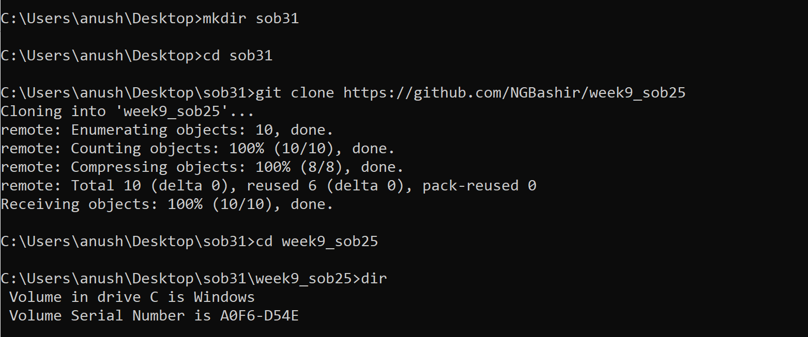
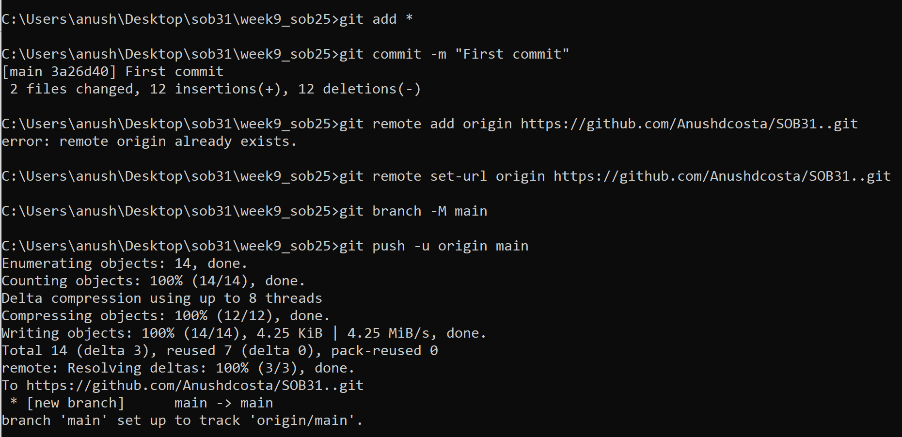

# Week9_SOB25
| Python file      | Description |
| ----------- | ----------- |
| broken_grades.py    | This program asks the user to enter 3 grades   and then shows whether he passed or failed. |
| broken_pirate.py   | This program asks the user for a password   to check if he is a pirate or not.|
| broken_travel.py | This program asks a time traveller   what year he is from and responds repectively|
| cowbulls_incomplete.py |This program is a number guessing   game that asks the user to enter a guess and returns the number of position accurate guesses and right guesses.|
| tictactoe_broken.py| This program is a basic simulation of the tic tac toe game.|

# __Git commands__
> * Creating a folder in the desktop and cloning a repository into this folder.

> * Once the files have been edited. Pushing the files in to the repository. by doing the following codes.
